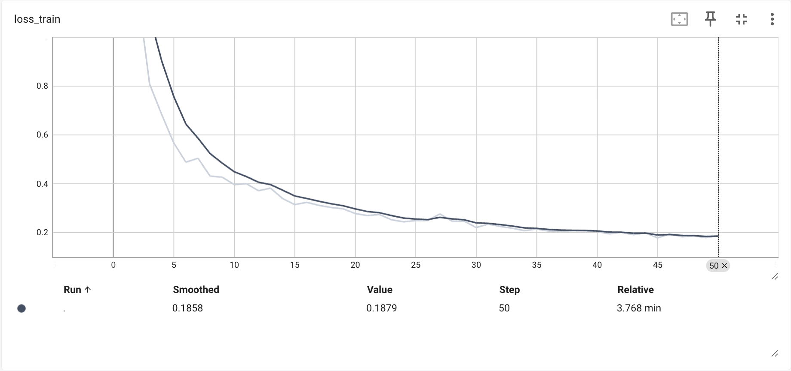
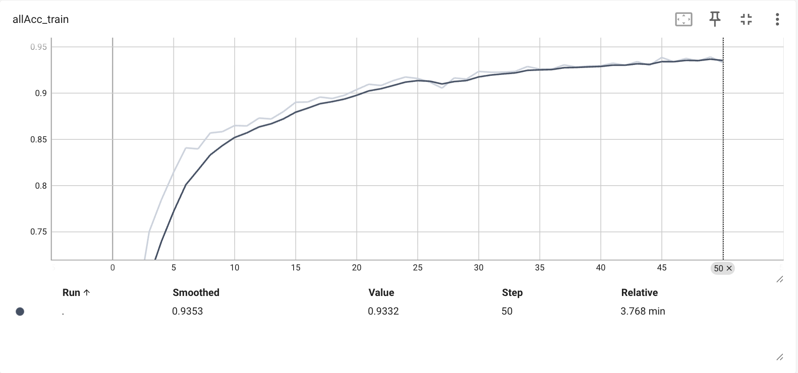
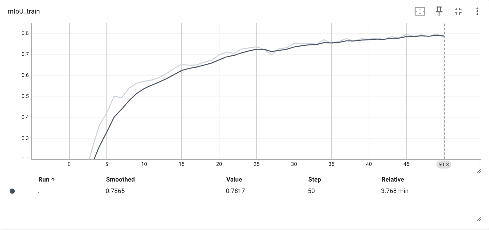

# 基于 DINOv3 Backbone 的 PSPNet
本仓库在 hszhao/semseg 的基础上修改，将 PSPNet 中的特征提取网络 ResNet 替换为 DINOv3 ConvNeXt Tiny，在 pascal voc 2012 数据集上训练和测试
## 修改内容
在原始仓库 hszhao/semseg 的基础上进行了如下修改：
1. 数据预处理
   - 改为读取彩色图像
   - 根据 DINOv3 processor 修改数据预处理流程
   - 修改图像剪裁、对齐和尺寸判定
2. 替换模型
   - 通过 Hugging Face Transformers 加载预训练的 dinov3-convnext-tiny-pretrain-lvd1689m 模型
   - 将第四个隐藏层的输出传入 Pyramid Pooling Module (PPM)
   - 将第三个隐藏层的输出用于辅助分类器 (aux)
   - 为保留浅层特征提取能力，同时考虑到数据集规模较小，冻结模型第 0 至 2 层参数
## 运行
### 环境
- GPU: RTX 4090 24GB * 1
- CUDA Version: 12.8
- docker 镜像: runpod/pytorch:1.0.2-cu1281-torch280-ubuntu2404(sha256:0a360022e8de4375af99430f84e8b38951acc397252163a37ceac7204d01be35)
- 额外安装 tensorboardX 2.6.4, transformers 4.57.1, huggingface-hub 0.35.3, opencv-python 4.12.0.88, hf_transfer 0.1.9

### 准备
1. 从 kaggle huanghanchina/pascal-voc-2012 下载数据集，解压至 semseg/datasets/voc2012 目录下
2. 使用 list.py 生成数据列表
3. 登陆 Huggingface 以便加载预训练模型

### 训练和测试
- 使用 sh tool/train.sh 启动训练和测试 （日志位于仓库./log目录下）
- 训练图像：



- 测试结果：mIoU/mAcc/allAcc 0.6969/0.8040/0.9311

## Citation

```
@misc{semseg2019,
  author={Zhao, Hengshuang},
  title={semseg},
  howpublished={\url{https://github.com/hszhao/semseg}},
  year={2019}
}
@inproceedings{zhao2017pspnet,
  title={Pyramid Scene Parsing Network},
  author={Zhao, Hengshuang and Shi, Jianping and Qi, Xiaojuan and Wang, Xiaogang and Jia, Jiaya},
  booktitle={CVPR},
  year={2017}
}
@inproceedings{zhao2018psanet,
  title={{PSANet}: Point-wise Spatial Attention Network for Scene Parsing},
  author={Zhao, Hengshuang and Zhang, Yi and Liu, Shu and Shi, Jianping and Loy, Chen Change and Lin, Dahua and Jia, Jiaya},
  booktitle={ECCV},
  year={2018}
}
```
